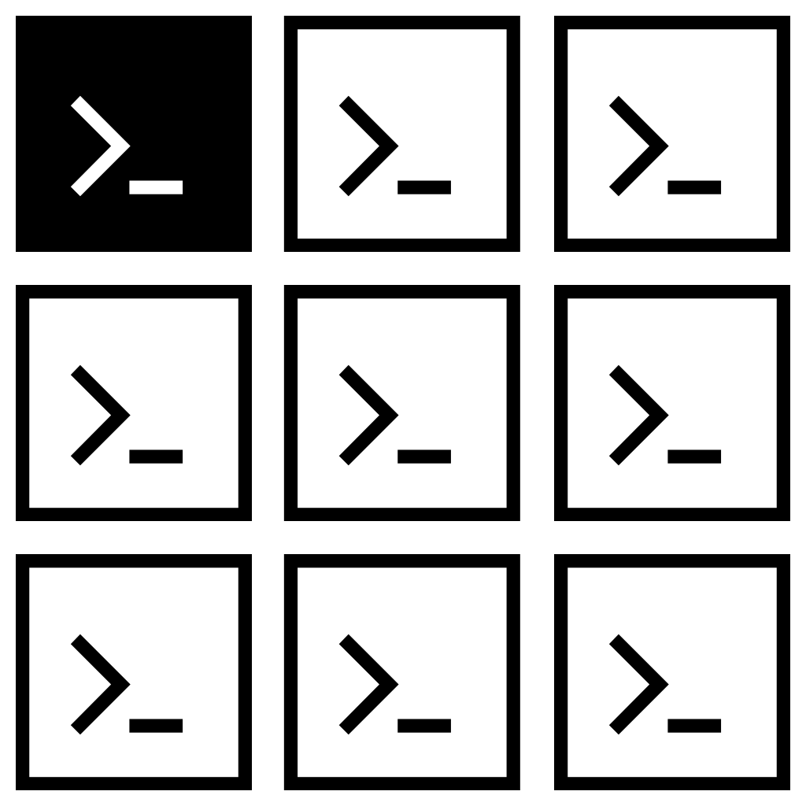

DDEV Command Collection
========================

<p align="center">
</p>

The __DCC__ (DDEV Commands Collection) provides several predefined [DDEV](https://ddev.readthedocs.io/en/stable/) commands for different project types.

The project comes with an automatic copy and update process of the commands as well as several customization options. So the DDEV commands in your local project under `.ddev/commands` will always keep updated extended commands.

For more usage information see the additional [README.md](src/CommandsCollection/general/static/README.md).

## Installation

Define one of the following project type:
- [TYPO3](src/CommandsCollection/typo3)
- [Symfony](src/CommandsCollection/symfony)
- [Drupal](src/CommandsCollection/drupal)

```json
"config": {
  "dcc-type": "Symfony"
}
```

Add the post scripts in the composer.json:

```json
"scripts": {
    "post-install-cmd": [
      "Kmi\\DdevCommandsCollection\\Composer\\Scripts::postInstall"
    ],
    "post-update-cmd": [
      "Kmi\\DdevCommandsCollection\\Composer\\Scripts::postUpdate"
    ]
}
```

Install from [packagist](https://packagist.org/packages/kmi/ddev-commands-collection) via composer:

```bash
$ composer req kmi/ddev-commands-collection
```

Add the following files to your local project git:

```bash
.ddev/
  dcc-config.sh
  dcc-config.yaml
  .gitignore
```